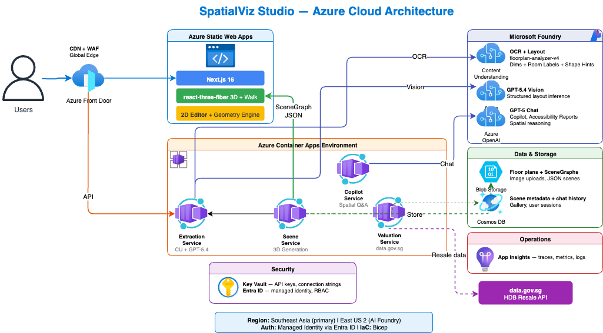
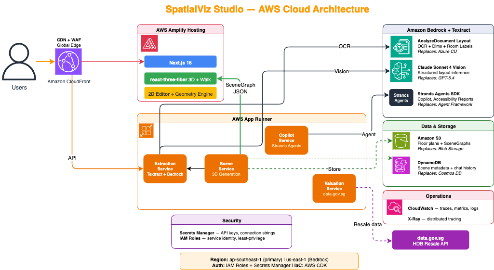

# SpatialViz Studio

**2D Floor Plans → Interactive 3D Walkable Spaces in Seconds**

Upload a 2D floor plan image and watch AI transform it into a walkable, interactive 3D visualization — complete with furniture, day/night lighting, first-person walkthrough with collision detection, and doors you can open by walking up and pressing **E**. Includes market valuation from data.gov.sg and a spatial copilot for accessibility analysis.

## Quick Start

### Prerequisites

- Node.js 20+ and npm
- Python 3.12+ and pip
- Azure subscription with OpenAI + Content Understanding (or run in demo mode)
- `az login` for DefaultAzureCredential (token-based auth)

### 1. Backend

```bash
cd backend
python -m venv .venv && source .venv/bin/activate
pip install -e .
cp .env.example .env   # Edit with your Azure endpoints
uvicorn app.main:app --reload --port 8000
```

### 2. Frontend

```bash
cd frontend
npm install
npm run dev
```

Open http://localhost:3000

### Demo Mode

If Azure credentials aren't configured, the backend serves a pre-built demo scene (Singapore HDB 4-room flat). Upload still works but returns the demo data.

## Architecture

### Current Architecture (Azure)



### AWS Production Architecture



### Data Flow

```
Floor plan upload (PNG/JPG)
  → Azure Content Understanding (OCR: dimensions, room labels, bounding boxes)
  → Vision LLM (structured layout inference)
  → 2D Editor (human-in-the-loop review and correction)
  → Geometry Engine (wall derivation, door/window openings)
  → Three.js extrusion (interactive 3D with walkthrough mode)
  → Market Valuation (data.gov.sg HDB resale data)
  → Spatial Copilot (accessibility analysis, room Q&A)
```

## Tech Stack

| Layer | Technology | AWS Equivalent |
|-------|-----------|----------------|
| Frontend | Next.js 16 + react-three-fiber v9 | Same (cloud-agnostic) |
| 3D Engine | Three.js + @react-three/drei | Same (cloud-agnostic) |
| Backend | FastAPI (Python 3.12) | Same (cloud-agnostic) |
| AI Vision | Azure OpenAI (vision-capable model) | Amazon Bedrock (vision-capable model) |
| Doc OCR | Azure Content Understanding | Amazon Textract |
| Agents | Microsoft Agent Framework | Strands Agents SDK |
| Hosting | Azure Container Apps + Static Web Apps | AWS App Runner + Amplify |
| Storage | Azure Blob Storage | Amazon S3 |
| IaC | Bicep | AWS CDK |

> **Model choice:** The pipeline is model-agnostic — any vision-capable LLM with structured-output support will work. For best floor-plan reasoning, use a strong vision model (e.g., **Claude Opus 4.7** or equivalent).

## Project Structure

```
├── frontend/                  # Next.js 16 + react-three-fiber
│   └── src/
│       ├── app/               # Pages and layouts
│       ├── components/
│       │   ├── upload-panel.tsx        # Floor plan upload + AI processing
│       │   ├── floor-plan-editor.tsx   # 2D editor (drag/resize/rotate rooms)
│       │   ├── viewer-3d.tsx           # 3D scene canvas + camera modes
│       │   ├── scene-derived.tsx       # Walls, doors, windows, furniture
│       │   ├── first-person-controls.tsx # WASD walk + wall collision
│       │   ├── scene-toolbar.tsx       # Orbit/Top/Walk/Day/Night controls
│       │   ├── chat-panel.tsx          # Spatial copilot
│       │   ├── valuation-panel.tsx     # HDB market valuation
│       │   └── report-panel.tsx        # Accessibility report
│       ├── lib/
│       │   └── geometry-engine.ts      # Wall derivation from room polygons
│       ├── store/
│       │   └── scene-store.ts          # Zustand state management
│       └── types/
│           └── scene.ts                # SceneGraph TypeScript types
├── backend/                   # FastAPI + Azure AI
│   └── app/
│       ├── main.py            # API routes (/extract, /generate-3d, /chat, etc.)
│       ├── extraction.py      # CU OCR + vision LLM layout inference pipeline
│       ├── vision.py          # Vision LLM analysis
│       ├── chat.py            # Spatial copilot agent
│       ├── valuation.py       # data.gov.sg HDB resale API
│       ├── demo_scene.py      # Pre-built demo scene
│       ├── config.py          # Settings + environment variables
│       └── models.py          # Pydantic schemas
├── docs/
│   ├── PRD.md                 # Product requirements document
│   ├── Azure-SpatialViz.drawio # Azure architecture diagram
│   ├── Azure-SpatialViz.svg   # Azure architecture (rendered)
│   ├── AWS-SpatialViz.svg     # AWS architecture (rendered)
│   └── AWS-SpatialViz.drawio  # AWS architecture diagram
├── sample-floor-plans/        # Sample HDB floor plans for testing
└── README.md                  # This file
```

## Sample Floor Plans

The `sample-floor-plans/` directory contains real Singapore HDB floor plans for testing:
- `3-room-tiong-bahru.png` — 3-room flat (recommended for demo)
- `3-room-redhill-close.png` — 3-room flat (alternate layout)
- `3-gen-flat.png` — 3Gen flat layout
